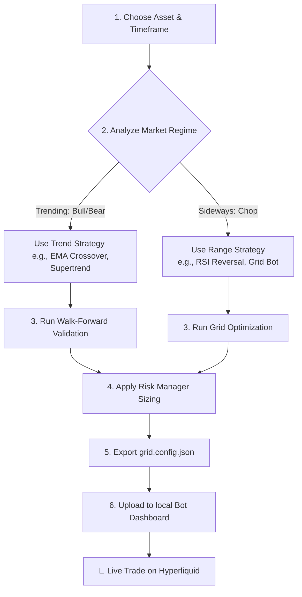

# 🌊 The Ultimate Simple Guide: Trading with the Crypto Strategy Lab

Welcome to the **Crypto Strategy Lab**! This guide explains how to use the website and the automated trading bot in simple, practical terms. No complex math, no confusing jargon—just clear steps to protect your capital and trade like a professional.

Think of this website as a **flight simulator**. You can test trading strategies on real historical crypto prices to see how they would have performed *before* risking any real money.

---

## 🧭 The Complete Trading Flow

Here is the exact journey from researching an idea to running it live:



---

## 🏄‍♂️ Step 1: Trends vs. Ranges (Choose Your Playbook)

No trading strategy works in all market conditions. A professional trader matches their strategy to the current **Regime** (behavior) of the market.

### Playbook A: Trend-Following (Ride the Wave)
When a coin is moving strongly in one direction (straight up or straight down), jump on the wave and ride it.
* **Best Strategies**: **EMA Crossover**, **MACD Crossover**, **Supertrend**, **Parabolic SAR**.
* **Analogy**: Like surfing. You wait for a wave to form, stand up on the board, and ride it as long as possible.
* **The Risk**: Flat, sideways markets. You will get "whipsawed"—buying minor bumps and selling immediate drops at a loss.

### Playbook B: Mean-Reversion / Oscillators (Play Ping-Pong)
When a coin is bouncing up and down within a horizontal boundaries, buy the lows and sell the highs.
* **Best Strategies**: **RSI Reversal**, **Stochastic Oscillator**, **Bollinger Bands**, **CCI**.
* **Analogy**: Like ping-pong. You buy near the floor (support) and sell near the ceiling (resistance).
* **The Risk**: Breakout trends. If the price skyrockets, you will lose money shorting it; if it crashes, you will hold a falling knife.

> [!TIP]
> **How to check the current regime**: Scroll to the **Market Regime Model** card at the bottom. It uses a statistical **Markov Model** to analyze the last 20 candles and tell you if the market is **BULL**, **BEAR**, or **SIDEWAYS**. It also gives a **Persistence** score—the probability that the current regime continues.

---

## 📊 Step 2: Running a Backtest

A backtest simulates how a strategy would have performed historically.

1. **Market Pair**: Search for any Binance pair in the sidebar (e.g. `BTC/USDT` or `SOL/USDT`).
2. **Timeframe**: Choose your candle size.
   * **15m / 30m**: Faster, active scalping.
   * **1h / 4h**: Calmer, swing trades.
3. **Date Range**: Click **30D**, **90D**, or **1Y** to load historical candles.
4. **Choose Strategy**: Select an indicator from the dropdown.
5. **Adjust Parameters**: Move the sliders to change settings. The charts and metrics will update instantly.

### How to read the Results Card:
* **Strategy Return**: The percentage profit or loss the strategy made during the simulation.
* **Buy & Hold**: What you would have made if you just bought the coin on day one and held it. **If your strategy return is lower than Buy & Hold, the strategy has no edge!**
* **Max Drawdown**: The deepest dip in your account balance from peak-to-trough. If this is **-12%**, your account dropped 12% at some point. Make sure this number is low enough that you can sleep at night!
* **Sharpe & Sortino Ratios** (Risk-adjusted reward):
  * **Below 1.0**: High risk, low reward. Skip.
  * **1.0 to 1.9**: Solid and tradeable.
  * **2.0+**: Outstanding. Extremely smooth equity curve.

---

## 🛡️ Step 3: Managing Risk and Position Sizing

The absolute #1 rule of trading is **never blow up your account**. Sizing your trades correctly is how you stay in the game.

### Position Sizing Modes
* **Fixed Size**: Every trade uses the exact same dollar amount (e.g. $1,000). Best for beginners.
* **Compounding**: If you win, your trade size increases. If you lose, it decreases. Snowballs your profits, but increases volatility.
* **Volatility Sizing (Recommended)**: Uses the **ATR (Average True Range)** indicator to measure volatility:
  * When the market gets highly volatile, the bot automatically **widens your stops** and **shrinks your trade size** so you risk the same dollar value.
  * When the market gets calm and quiet, it **tightens your stops** and **increases your trade size**.
  * Set your **Target Risk %** to **1%** or **2%** per trade.

### Safety Exits
* **Stop Loss %**: The emergency exit. If a trade goes against you by this percentage, it cuts the loss immediately. **Always set a stop loss!**
* **Take Profit %**: Closes the trade at a set profit target.
* **Risk Manager (Bottom Card)**: It analyzes your closed trades and suggests optimal Stop Loss and Take Profit levels automatically.

---

## 🔬 Step 4: Advanced Verification Checks

Before deploying a strategy, look at the advanced validation panels at the bottom:

### 1. Walk-Forward Validation (Overfitting Filter)
Overfitting is when you adjust your settings so perfectly to past data that they fail in real-time because they memorized noise.
* The system splits the data into 5 segments, optimizes settings on the first part, and tests them on unseen forward segments.
* If the verdict is **Robust**, the strategy is steady and ready. If the verdict is **Overfit**, the settings are fragile—change them or choose a different timeframe.

### 2. Strategy Correlation Matrix (Diversification Check)
If you trade multiple strategies at once, you want them to behave differently. If they do the same thing, they will enter identical trades, doubling your risk.
* Check the matrix heatmap:
  * **Blue / Green cells**: The strategies are uncorrelated or opposite. Perfect for running together!
  * **Red cells**: The strategies are highly correlated (> 0.50). Do not run both.
* The card automatically recommends the **Best Diversified Portfolio** combination.

---

## ⚙️ Step 5: The Grid Optimizer (Sideways Cash Machine)

Grid trading is special: it doesn't care if the price goes up or down. It sets up a "net" of buy and sell orders around the current price. When the price dips, it buys; when it rises, it sells, stacking small profits.

### Spacing vs. Fees Rule
Every grid trade pays exchange fees. 
* Look at **Spacing ÷ Breakeven** in the **Grid Optimizer** panel.
* This number **must be at least 3.0×**.
* If it is lower, your grids are spaced too close together, and trading fees will eat up all of your profits.

---

## 🚀 Step-by-Step Live Bot Deployment

Once you have optimized your strategy and grid settings on the website, follow these steps to deploy the live bot.

### Step 1: Start your local Bot Dashboard
Open a terminal on your computer and run:
```powershell
# Navigate to the bot directory
cd c:\Users\ken25\trading\bot

# Install dependencies (only needed the first time)
npm install

# Start the local bot server
npm start
```
This runs the local bot engine. Open `http://localhost:3001` in your web browser to view the **Bot Dashboard**.

### Step 2: Download your config
1. On the website's **Grid Optimizer** page, scroll to the **Deploy to Bot** section.
2. Enter your **Budget** (e.g. 500 USDC) and **Leverage** (e.g. 1x or 2x).
3. Set your **Stop Loss** and **Take Profit** percentages.
4. Click the **Download grid.config.json** button.

### Step 3: Start live trading
1. Open your local dashboard (`http://localhost:3001`).
2. Drag and drop the downloaded `grid.config.json` file into the dashboard.
3. Click **Start Bot**.
4. The bot will connect to the Hyperliquid exchange, place the buy and sell grids, and display your active profits and positions in real time!

---

## ❓ Frequently Asked Questions (FAQ)

### Q: Why is my strategy return lower than Buy & Hold?
A: In strong bull markets, simply holding the coin is hard to beat. Your strategy is designed to protect your downside. If your strategy made 40% with a 3% drawdown, while Buy & Hold made 60% with a 45% drawdown, your strategy is actually superior on a risk-adjusted basis (a higher Sharpe ratio).

### Q: What is the difference between Arithmetic and Geometric Grids?
* **Arithmetic**: Places buy/sell grid lines at equal absolute dollar intervals (e.g., every $10). Best for low-price assets or narrow ranges.
* **Geometric**: Places lines at equal percentage steps (e.g., every 1.5%). **Highly recommended for crypto** because a 2% price move has the same economic meaning whether Bitcoin is at $30,000 or $60,000.

### Q: How do I get API keys for the Hyperliquid Bot?
1. Go to the Hyperliquid exchange (Testnet or Mainnet).
2. Go to your Profile -> API agent.
3. Generate an API Agent Key. This creates a separate restricted key that can place orders but *cannot withdraw funds*, keeping your assets safe.
4. Paste this key and your user wallet address into your local bot's `.env` file under `HL_AGENT_PRIVATE_KEY` and `HL_USER_ADDRESS`.

> [!WARNING]
> Always run your bot on **Hyperliquid Testnet** (demo mode) first to verify your API keys and grid settings before using real money!
