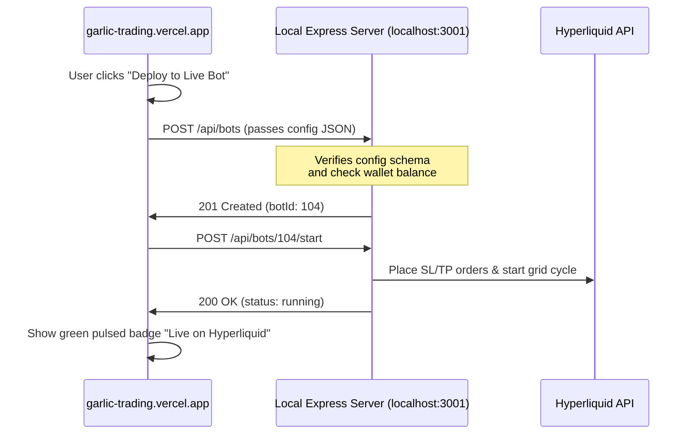

# 🚀 Deep-Dive Codebase & Usability Improvements (Making the Platform 10x Better)

This document details comprehensive, next-level improvements across the **front-end web application** and the **automated Hyperliquid trading bot** (`bot/`). It covers advanced mathematical models, execution logic, software architecture patterns, and UI/UX design paradigms to elevate this from a hobby project into a production-grade quant trading platform.

---

## 🧭 1. Front-End Usability & Premium UI/UX Aesthetics

To deliver an elite, wowed-at-first-glance interface that avoids generic AI aesthetics, we identify several key design principles and concrete enhancements:

### 🌟 Stacking Contexts, Sticky Headers & Table Clashing
* **The Problem**: Sticky columns (like index numbers and action buttons) and headers in scrolling containers generate a new stacking context. When combined with tooltips or nested search dropdowns, standard z-index layers can clash, causing elements to render beneath scrollable table headers.
* **The Solution**: 
  - Ensure the sidebar containers (`aside`) use `relative z-30` or `lg:z-30` at all times, elevating them above main scrolling panels.
  - Implement a dedicated portal container (`<div id="tooltip-root" />` and `<div id="dropdown-root" />`) at the root of the React app. Any popup list or tooltip must render via `createPortal` to attach directly to `document.body` with `z-[9999]`, calculating bounds dynamically on scroll/resize using the `getBoundingClientRect()` of the trigger element.

### 📊 Clean Table Scrolling, Borders & Opaque Backdrops
* **The Problem**: Setting background opacity on `tr` or `tbody` elements inside scrollable panels leads to content bleed (seeing the background text scroll behind sticky cells).
* **The Solution**:
  - Force sticky cells (`th` and `td`) to have solid backgrounds matching the theme (`bg-panel` or `bg-panel-2`).
  - Never draw border rules on table rows (`tr`), as sticky cells will overlap and render them invisible. Instead, apply borders directly on the cell elements (`border-t border-b border-border/40`).

### 🛠️ Interactive Candlestick Zooming & Panning
* **The Problem**: Traders struggle to correlate raw table logs (like high drawdown periods or massive wins) to the visual candlestick chart.
* **The Solution**:
  - Integrate a click callback on all trade log items in `Results.tsx` to set a `selectedTrade` global state.
  - In `ChartPanel.tsx`, listen to `selectedTrade` changes. Calculate the candle duration spacing, and use `chart.timeScale().setVisibleRange()` to automatically center the view on the trade's entry and exit times.
  - Render color-coded horizontal price lines (dashed green for entry, dashed red for exit) using `series.createPriceLine()`. Clean these lines up dynamically when the selected trade changes or is cleared.

---

## 💻 2. Capital Allocation & Advanced Risk Engine

The absolute core of long-term trading survival is capital preservation. We propose the following upgrades to the risk management layer:

### ⚙️ Volatility-Adjusted ATR Position Sizing
Currently, traders manually choose arbitrary position sizes. We recommend implementing an automated **Average True Range (ATR)** position sizing engine:
$$\text{Position Size (tokens)} = \frac{\text{Capital} \times \text{Target Risk \%}}{\text{ATR}(N) \times \text{Multiplier}}$$
* **How it works**: If a trader risks $2\%$ of their capital on a trade, and the coin's ATR indicates high volatility, the stop-loss is placed wider, and the position size is automatically reduced. If volatility is low, the stop-loss is tight, and the size is scaled up.
* **Code Implementation (Backtest Engine)**:
  ```typescript
  const currentAtr = atrValues[i];
  const stopLossDist = currentAtr * atrMultiplier;
  const targetRiskValue = totalCapital * (targetRiskPct / 100);
  const positionSizeUsd = (targetRiskValue / stopLossDist) * entryPrice;
  ```

### 🧮 Half-Kelly Sizing recommendation
In the `Results.tsx` Risk Manager, we should transition from static tables to dynamic capital recommendations based on the **Kelly Criterion**:
$$f^* = \frac{p \times R - (1 - p)}{R}$$
Where:
- $f^*$ = fraction of capital to risk.
- $p$ = historical Win Rate.
- $R$ = historical Risk-to-Reward ratio (implied by Avg Win / Avg Loss).
- **Recommendation**: Always display and suggest **Half-Kelly Sizing** ($f^* / 2$) to account for non-Gaussian tail risk and parameter drift.

---

## 🔌 3. High-Frequency Execution & Exchange Integration

For the automated trading bot (`bot/`) to trade safely on Hyperliquid, execution logic must be optimized to handle latency, market impact, and API constraints:

### ⚡ Slippage Control and Order Book Imbalance
* **Limit Order Chase**: Placing static limit orders can result in missed entries during strong breakouts. The bot should monitor the order book spread. If a limit order remains unfilled for $M$ blocks, it should "chase" the order book up to a maximum defined slippage percentage.
* **Order Book Imbalance (OBI)**:
  $$\text{OBI} = \frac{\text{Bid Size} - \text{Ask Size}}{\text{Bid Size} + \text{Ask Size}}$$
  The bot should pause placing bid orders if $\text{OBI} < -0.6$ (significantly more sellers than buyers), preventing it from catching falling knives.

### 📥 WebSocket Consolidated Streams & Rate-Limit Backoff
* **Consolidated Feed**: Rather than spinning up separate WebSocket connections for each bot, implement a single **Websocket multiplexer** in `bot/src/exchange.ts` that subscribes to all active user asset feeds on a single connection.
* **Rate Limits**: Hyperliquid limits requests to 1,200 per minute. Implement a token-bucket rate limiter that queues orders and prioritizes cancel requests during fast markets.
* **Exponential Backoff**: If the API returns a HTTP 429 status, the bot must back off exponentially:
  $$t_{\text{wait}} = \text{min}(60, t_{\text{base}} \times 2^{\text{attempt}}) + \text{jitter}$$

---

## 🧠 4. Machine Learning & Predictive Regimes

Transitioning from simple heuristic indicators to statistical models to predict market behavior:

### 📈 Hidden Markov Models (HMM) for Regime Classification
Instead of our simple rolling-return Markov classifier, we can train a 3-state HMM using:
1. Rolling volatility (std dev of returns)
2. Volume rate-of-change
3. Average directional index (ADX)

An HMM models the market as hidden states that generate these observable features, capturing structural shifts (e.g., transition from high-volatility chop to low-volatility trend) with much higher statistical accuracy.

### 🎛️ Regime-Weighted Ensemble Voting
When running the Multi-Strategy Ensemble, signals from different strategies should be weighted dynamically according to the active HMM state:
$$\text{Signal Score} = \sum_{i=1}^{M} w_i(s) \cdot \text{Signal}_i$$
Where $w_i(s)$ is the weight of strategy $i$ in regime $s$:
* **Bull/Bear (Trending)**: Set $w(\text{Supertrend}) = 2.5$, $w(\text{EMA}) = 2.0$, $w(\text{RSI}) = 0.2$.
* **Sideways (Chop)**: Set $w(\text{RSI}) = 2.5$, $w(\text{Stochastic}) = 2.0$, $w(\text{Supertrend}) = 0.1$.

---

## 🏗️ 5. Software Architecture & Developer Velocity

To scale the platform and support a large number of strategies, timeframes, and bots:

### 📦 Centralized State Management (Zustand)
* **The Problem**: Currently, parameters and backtester states are passed via long prop-drilling trees between `BacktesterPage.tsx`, `Controls.tsx`, and `Results.tsx`.
* **The Solution**: Build a `useStore` store using **Zustand** to encapsulate strategy settings, symbol lists, backtest results, and active chart drawings. This reduces re-renders and decouples components cleanly.

### 🧵 Web Workers for Client-Side Calculations
* **The Problem**: Running walk-forward parameter sweeps or correlation matrices for 13 strategies freezes the main UI thread for several hundred milliseconds on mobile or lower-end laptops.
* **The Solution**: Offload backtesting calculations to a Web Worker (`backtest.worker.ts`). The main thread passes klines and strategy configurations, and receives the final metrics back asynchronously:
  ```typescript
  const worker = new Worker(new URL('./backtest.worker.ts', import.meta.url));
  worker.postMessage({ candles, strategies });
  worker.onmessage = (e) => setResult(e.data);
  ```

### 🔬 Walk-Forward Parameter Validation
* **The Problem**: Overfitting. Strategy configurations that show massive returns in past data often lose money live because they are tuned to noise.
* **The Solution**: Automatically run overlapping walk-forward partitions. If the Out-of-Sample Sharpe ratio drops below $50\%$ of the In-Sample Sharpe, flag the strategy as **Fragile / Overfit** in the UI, locking out live deployment controls.

---

## 🔌 6. Direct API Deployments (Future Roadmaps)

To streamline the user workflow and remove manual file exports:



1. **CORS Middleware**: Enable Express CORS in `bot/src/server.ts` to authorize incoming requests from `garlic-trading.vercel.app` and `localhost:5173`.
2. **Localhost API Client**: Develop `src/lib/botApi.ts` using `fetch` with error boundaries. If `localhost:3001` is unreachable, gracefully fallback to the manual JSON download buttons.
3. **P&L Streaming**: Establish a server-sent events (SSE) feed from `localhost:3001` directly to the web app interface to display active floating P&L on the chart alongside historical curves.
